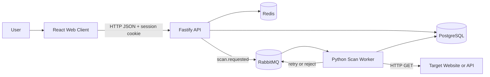
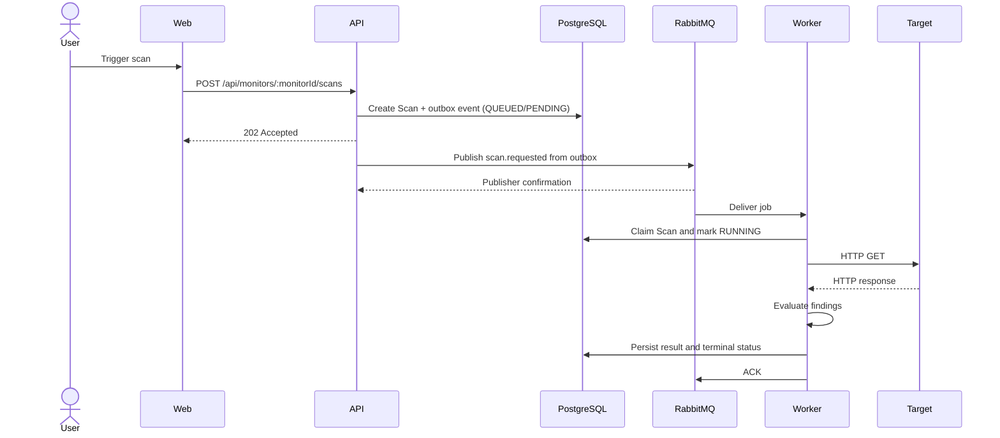

# OntaPulse

A monorepo-based website and API monitoring platform for managing targets, running asynchronous HTTP checks, and reviewing scan results and operational findings within collaborative workspaces.

OntaPulse separates request handling from scan execution. The API persists a scan with the `QUEUED` status and publishes a job to RabbitMQ. A Python worker consumes the job, validates URL safety, performs the HTTP check, evaluates the result, and stores the terminal status and findings in PostgreSQL. The web client provides interfaces for authentication, workspaces, projects, monitors, scans, and member management.

> **Project status:** actively developed. The primary workflow from the web client through the worker is available. Capabilities such as notifications and monitor update/delete operations have not been implemented yet.

## Table of contents

- [Key features](#key-features)
- [Implementation status](#implementation-status)
- [System architecture](#system-architecture)
- [Scan lifecycle](#scan-lifecycle)
- [Domain model](#domain-model)
- [Workspace permissions](#workspace-permissions)
- [Technology stack](#technology-stack)
- [Repository structure](#repository-structure)
- [Prerequisites](#prerequisites)
- [Quick start](#quick-start)
- [Environment configuration](#environment-configuration)
- [Running the applications](#running-the-applications)
- [Local services and endpoints](#local-services-and-endpoints)
- [API overview](#api-overview)
- [Database and migrations](#database-and-migrations)
- [RabbitMQ and retry policy](#rabbitmq-and-retry-policy)
- [Worker](#worker)
- [Web client](#web-client)
- [Testing and quality checks](#testing-and-quality-checks)
- [Security](#security)
- [Development conventions](#development-conventions)
- [Troubleshooting](#troubleshooting)
- [Current limitations](#current-limitations)
- [Additional documentation](#additional-documentation)
- [License](#license)
- [Author](#author)

## Key features

- Registration, login, logout, and `httpOnly` cookie-based sessions stored in Redis.
- Multi-user workspaces with `OWNER`, `ADMIN`, and `MEMBER` roles.
- Workspace member management: list members, add registered users, change roles, and remove members according to permissions.
- Projects for organizing monitors within a workspace.
- HTTP/HTTPS monitors with stored intervals and URL validation.
- Manual and interval-based scan triggering through the API scheduler and web client.
- Asynchronous scan processing through RabbitMQ.
- HTTP GET checks with explicit timeouts, response-time measurement, and SSRF protection.
- Findings for HTTP 4xx responses, HTTP 5xx responses, and slow responses.
- Bounded delayed retries at 5, 30, and 120 seconds for infrastructure failures.
- A dead-letter queue for invalid messages, permanent errors, and exhausted retries.
- Idempotent processing to handle duplicate deliveries safely.
- Structured logging, graceful shutdown, connection recovery, and active-job draining in the worker.
- Swagger UI, a liveness endpoint, and a database readiness endpoint.
- API unit/integration tests and opt-in worker infrastructure tests.

## Implementation status

| Area                        |    Status     | Notes                                                                                 |
| --------------------------- | :-----------: | ------------------------------------------------------------------------------------- |
| Web interface               |   Available   | Landing/auth, dashboard, workspaces, projects, monitors, scans, and workspace members |
| Authentication and sessions |   Available   | Argon2id, session cookies, and Redis session storage                                  |
| Workspaces and roles        |   Available   | `OWNER`, `ADMIN`, and `MEMBER` authorization                                          |
| Projects and monitors       |   Available   | Create and list; rename and delete projects; monitors cannot be edited or deleted     |
| Scan API                    |   Available   | Trigger, list by monitor, and scan details                                            |
| PostgreSQL persistence      |   Available   | Prisma in the API and SQLAlchemy in the worker                                        |
| RabbitMQ producer           |   Available   | Transactional outbox, durable topology, mandatory routing, and publisher confirms     |
| Python scan worker          |   Available   | HTTP execution, database lifecycle, retries, DLQ, and controlled shutdown             |
| Findings                    |   Available   | Client errors, server errors, and slow responses                                      |
| Automatic scheduling        |   Available   | Active monitors are queued at their configured interval                               |
| Notifications and alerting  | Not available | No notification channel or escalation policy yet                                      |
| Resource update/delete      |    Partial    | Workspaces and projects can be renamed and deleted; monitors cannot                   |

## System architecture



| Component  | Responsibility                                                                                             |
| ---------- | ---------------------------------------------------------------------------------------------------------- |
| Web        | User interface, navigation, forms, API calls, and presentation of scan statuses and findings               |
| API        | HTTP contracts, authentication, authorization, validation, business rules, persistence, and job publishing |
| PostgreSQL | Source of truth for users, workspaces, projects, monitors, scans, and findings                             |
| Redis      | Session storage and temporary state; it is not the primary scan queue                                      |
| RabbitMQ   | Durable, at-least-once delivery of scan jobs                                                               |
| Worker     | Job validation, scan claiming, HTTP checks, finding evaluation, and result persistence                     |

The API uses the following module flow:

```text
route -> controller -> service -> repository -> Prisma/PostgreSQL
```

The worker uses feature-first boundaries based on a hexagonal architecture:

```text
domain <- application (ports, lifecycle) <- adapters
```

See [docs/architecture.md](docs/architecture.md) for component boundaries, resource ownership, composition roots, and data flow.

## Scan lifecycle



Important lifecycle properties:

1. The API returns `202 Accepted` after the Scan and pending outbox event have committed together.
2. The outbox publisher waits for RabbitMQ confirmation before marking an event `PUBLISHED`.
3. RabbitMQ provides at-least-once delivery. The worker treats `scanId` as an idempotency key.
4. HTTP 4xx and 5xx responses still mean the target returned an HTTP response. The scan becomes `SUCCEEDED` and may produce a finding.
5. Timeouts, DNS failures, and target connection failures are stored as terminal `FAILED` scan results and do not use RabbitMQ retries.
6. RabbitMQ retries are reserved for infrastructure failures that prevent the worker from completing the database lifecycle safely.
7. The outbox publisher marks an event published only after RabbitMQ confirmation and retries events whose lease expires or publish fails.

## Domain model

```text
User
└── WorkspaceMember (role per workspace)
    └── Workspace
        └── Project
            └── Monitor
                └── Scan
                    └── ScanFinding
```

| Entity            | Primary purpose                                                                 |
| ----------------- | ------------------------------------------------------------------------------- |
| `User`            | User account and hashed credentials                                             |
| `Workspace`       | Collaboration and access-isolation boundary                                     |
| `WorkspaceMember` | User-workspace relationship and role                                            |
| `Project`         | Logical grouping for monitors                                                   |
| `Monitor`         | HTTP/HTTPS target definition and interval                                       |
| `Scan`            | One check execution with a `QUEUED`, `RUNNING`, `SUCCEEDED`, or `FAILED` status |
| `ScanFinding`     | A structured issue identified from a scan result                                |

Use the [Prisma schema](apps/api/prisma/schema.prisma) as the source of truth for fields, enums, relationships, indexes, uniqueness constraints, and cascade behavior.

## Workspace permissions

Roles apply per workspace rather than globally. The same user may be an `OWNER` in one workspace and a `MEMBER` in another.

| Capability                         | OWNER | ADMIN | MEMBER |
| ---------------------------------- | :---: | :---: | :----: |
| View joined workspaces             |  Yes  |  Yes  |  Yes   |
| Create a new workspace             |  Yes  |  Yes  |  Yes   |
| View workspace members             |  Yes  |  Yes  |  Yes   |
| Add a registered member            |  Yes  |  Yes  |   No   |
| Change another member's role       |  Yes  |  No   |   No   |
| Remove a `MEMBER`                  |  Yes  |  Yes  |   No   |
| Remove an `ADMIN`                  |  Yes  |  No   |   No   |
| Change or remove the `OWNER`       |  No   |  No   |   No   |
| Read projects, monitors, and scans |  Yes  |  Yes  |  Yes   |
| Create projects and monitors       |  Yes  |  Yes  |   No   |
| Trigger scans                      |  Yes  |  Yes  |   No   |

Resources outside a user's workspaces return `404`, preventing the API from disclosing whether those resources exist.

## Technology stack

### Core toolchain

| Category                   | Technology     | Repository version/policy                    |
| -------------------------- | -------------- | -------------------------------------------- |
| Monorepo orchestration     | Moon           | Configured under `.moon/`                    |
| JavaScript package manager | pnpm           | `11.22.0`                                    |
| Node.js                    | Node.js        | `24.14.0`                                    |
| Python                     | Python         | `3.13.2`; the worker supports `>=3.13,<3.14` |
| Python package manager     | uv             | Uses `apps/worker/uv.lock`                   |
| Container runtime          | Docker Compose | Runs PostgreSQL, Redis, and RabbitMQ         |

### Web

- React 19
- React Router 7
- Vite 8
- TypeScript 5
- Tailwind CSS 4
- Radix UI and shadcn-style primitives
- Motion, Anime.js, OGL, Lucide React, and Sonner

### API

- Fastify 5
- TypeScript and ESM
- Zod 4 and Fastify JSON Schema
- Prisma 7 with the PostgreSQL adapter
- Redis client
- amqplib
- Argon2id
- Swagger/OpenAPI
- Vitest

### Worker

- Python 3.13
- HTTPX
- Pika
- SQLAlchemy 2
- Psycopg 3
- Pydantic Settings
- Pytest and Ruff

### Local infrastructure

- PostgreSQL 17 Alpine
- Redis 7 Alpine with AOF enabled
- RabbitMQ 4 Management Alpine

## Repository structure

```text
OntaPulse/
├── .moon/                 Moon workspace and toolchain configuration
├── apps/
│   ├── api/               Fastify API, Prisma, migrations, and API tests
│   ├── web/               React/Vite web client
│   └── worker/            Python scan worker and worker tests
├── docs/
│   ├── architecture.md    Architecture and data flow
│   ├── development.md     Complete development workflow
│   ├── queue-contract.md  RabbitMQ producer-consumer contract
│   └── display-content-mapping.md
├── packages/              Space for shared packages
├── .env.example           Local configuration template
├── .prototools            Node.js, pnpm, and Python versions
├── docker-compose.yml     PostgreSQL, Redis, and RabbitMQ
├── package.json           Root metadata and scripts
├── pnpm-lock.yaml         JavaScript/TypeScript lockfile
└── pnpm-workspace.yaml    pnpm workspace definition
```

Web structure:

```text
apps/web/src/
├── app/       Providers, router, layouts, and global styles
├── pages/     Route-level composition
├── widgets/   Reusable screen sections
├── features/  User-facing business actions
├── entities/  Domain representations
└── shared/    API client, types, utilities, and UI primitives
```

Worker structure:

```text
apps/worker/ontapulse_worker/
├── bootstrap/    Dependency composition and resource ownership
├── entrypoints/  Worker startup and operational commands
├── modules/
│   └── scans/
│       ├── domain/
│       ├── application/
│       └── adapters/
└── platform/     Configuration, database, messaging, logging, and resilience
```

## Prerequisites

The development machine must have:

- Git;
- Docker Desktop or Docker Engine with Docker Compose;
- [proto](https://moonrepo.dev/proto) and Moon, following the repository workflow;
- Node.js `24.14.0`;
- pnpm `11.22.0`;
- Python `3.13.2`;
- uv for worker dependencies.

Runtime versions are declared in `.prototools`. When using proto, install the toolchain versions from that file. Do not change runtime or lockfile versions without testing the complete workspace.

## Quick start

### 1. Clone the repository

```bash
git clone <repository-url>
cd OntaPulse
```

### 2. Create the environment file

Linux/macOS:

```bash
cp .env.example .env
```

PowerShell:

```powershell
Copy-Item .env.example .env
```

Replace every password placeholder in `.env`. For local development, keep `localhost` in the connection URLs because the API and worker run directly on the host.

### 3. Install dependencies

```bash
pnpm install
moon run worker:sync
```

The second command runs `uv sync --locked` to prepare the worker's Python environment.

### 4. Start the infrastructure

```bash
docker compose up -d
docker compose ps
```

Wait until PostgreSQL, Redis, and RabbitMQ are healthy.

### 5. Apply migrations and seed development data

```bash
pnpm --filter @ontapulse/api exec prisma migrate dev
pnpm --filter @ontapulse/api db:seed
```

The seed is deterministic and uses `upsert`. It refuses to run unless the environment is development, PostgreSQL is local, and the database name does not look like a test database.

### 6. Start the applications

Open three terminals at the repository root.

Terminal 1 - API:

```bash
moon run api:dev
```

Terminal 2 - worker:

```bash
moon run worker:dev
```

Terminal 3 - web:

```bash
moon run web:dev
```

### 7. Open the application

- Web: [http://localhost:5173](http://localhost:5173)
- Swagger UI: [http://localhost:3000/docs](http://localhost:3000/docs)
- API liveness: [http://localhost:3000/health](http://localhost:3000/health)
- API readiness: [http://localhost:3000/ready](http://localhost:3000/ready)
- RabbitMQ Management: [http://localhost:15672](http://localhost:15672)

These ports follow `.env.example` and `vite.config.ts`. Adjust the URLs if your local configuration differs.

## Environment configuration

| Variable                   | Example/default          | Used by           | Purpose                                                  |
| -------------------------- | ------------------------ | ----------------- | -------------------------------------------------------- |
| `NODE_ENV`                 | `development`            | API, worker       | Selects `development`, `test`, or `production` behavior  |
| `API_PORT`                 | `3000`                   | API               | Fastify listening port                                   |
| `POSTGRES_USER`            | `ontapulse`              | Compose/API       | PostgreSQL user                                          |
| `POSTGRES_PASSWORD`        | placeholder              | Compose/API       | PostgreSQL password; must be changed                     |
| `POSTGRES_DB`              | `ontapulse`              | Compose/API       | Database name                                            |
| `POSTGRES_PORT`            | `5433`                   | Compose/API       | PostgreSQL host port                                     |
| `DATABASE_URL`             | PostgreSQL URL           | API, worker       | Database connection string                               |
| `REDIS_PORT`               | `6379`                   | Compose           | Redis host port                                          |
| `REDIS_URL`                | `redis://localhost:6379` | API               | Redis session store                                      |
| `RABBITMQ_USER`            | `ontapulse`              | Compose/API       | RabbitMQ user                                            |
| `RABBITMQ_PASSWORD`        | placeholder              | Compose/API       | RabbitMQ password; must be changed                       |
| `RABBITMQ_PORT`            | `5672`                   | Compose/API       | AMQP host port                                           |
| `RABBITMQ_MANAGEMENT_PORT` | `15672`                  | Compose           | Management UI host port                                  |
| `RABBITMQ_URL`             | AMQP URL                 | API, worker       | Broker connection string                                 |
| `VITE_API_PROXY_TARGET`    | `http://localhost:3000`  | Vite dev server   | Proxy target for `/api` requests                         |
| `VITE_API_BASE_URL`        | empty                    | Web build/runtime | API origin prefix when web and API use different origins |
| `WORKER_INFRA_TESTS`       | unset                    | Worker tests      | Opt-in switch for infrastructure tests                   |

Configuration notes:

- `.env` is used for development; `.env.test` is used for tests.
- Never commit `.env`, `.env.test`, real credentials, or complete sensitive connection strings.
- Percent-encode URL-reserved password characters inside `DATABASE_URL` and `RABBITMQ_URL`.
- Applications running on the host use `localhost` or `127.0.0.1`.
- Applications running inside the Docker network use the service names `postgres`, `redis`, and `rabbitmq`.
- `RABBITMQ_URL` is required outside test mode.
- The test database must be separate from development and should use a `_test` suffix.

## Running the applications

### Repository commands

| Task                  | Command             |
| --------------------- | ------------------- |
| Format the repository | `pnpm format`       |
| Check formatting      | `pnpm format:check` |

### API

| Task                  | Command                                        |
| --------------------- | ---------------------------------------------- |
| Development server    | `moon run api:dev`                             |
| Type-check            | `moon run api:typecheck`                       |
| Test through Moon     | `moon run api:test`                            |
| Test through pnpm     | `pnpm --filter @ontapulse/api test`            |
| Watch tests           | `pnpm --filter @ontapulse/api test:watch`      |
| Seed development data | `pnpm --filter @ontapulse/api db:seed`         |
| Apply test migrations | `pnpm --filter @ontapulse/api test:db:migrate` |

### Web

| Task               | Command                                |
| ------------------ | -------------------------------------- |
| Development server | `moon run web:dev`                     |
| Type-check         | `moon run web:typecheck`               |
| Production build   | `moon run web:build`                   |
| Preview the build  | `pnpm --filter @ontapulse/web preview` |

### Worker

| Task                        | Command                            |
| --------------------------- | ---------------------------------- |
| Synchronize dependencies    | `moon run worker:sync`             |
| Run the worker              | `moon run worker:dev`              |
| Check database connectivity | `moon run worker:check-db`         |
| Run unit tests              | `moon run worker:test`             |
| Run integration tests       | `moon run worker:integration-test` |
| Lint                        | `moon run worker:lint`             |
| Format                      | `moon run worker:format`           |
| Check formatting            | `moon run worker:format-check`     |

### Infrastructure

| Task                                | Command                              |
| ----------------------------------- | ------------------------------------ |
| Start                               | `docker compose up -d`               |
| Inspect status and health           | `docker compose ps`                  |
| Stop without removing volumes       | `docker compose stop`                |
| View PostgreSQL logs                | `docker compose logs postgres`       |
| View Redis logs                     | `docker compose logs redis`          |
| View RabbitMQ logs                  | `docker compose logs rabbitmq`       |
| Show the PostgreSQL port mapping    | `docker compose port postgres 5432`  |
| Show the RabbitMQ AMQP port mapping | `docker compose port rabbitmq 5672`  |
| Show the RabbitMQ UI port mapping   | `docker compose port rabbitmq 15672` |

## Local services and endpoints

| Service             | Default URL/address            | Description                              |
| ------------------- | ------------------------------ | ---------------------------------------- |
| Web app             | `http://localhost:5173`        | Vite development server                  |
| API                 | `http://localhost:3000`        | Fastify server                           |
| Swagger UI          | `http://localhost:3000/docs`   | Interactive OpenAPI documentation        |
| Liveness            | `http://localhost:3000/health` | Confirms that the API process is running |
| Readiness           | `http://localhost:3000/ready`  | Confirms that PostgreSQL is reachable    |
| PostgreSQL          | `localhost:5433`               | Host port from `.env.example`            |
| Redis               | `localhost:6379`               | Session store                            |
| RabbitMQ AMQP       | `localhost:5672`               | Broker connection                        |
| RabbitMQ Management | `http://localhost:15672`       | Queue and connection inspection          |

The API opens its RabbitMQ connection lazily when the first scan is triggered. The API may therefore start while the broker is unreachable, but scan-trigger requests still require a healthy RabbitMQ instance.

## API overview

All business endpoints use the `/api` prefix. Health endpoints and Swagger UI are served at the root. Swagger UI and route schemas are the source of truth for request and response contracts.

### Authentication

| Method | Endpoint             | Access            | Purpose                                                            |
| ------ | -------------------- | ----------------- | ------------------------------------------------------------------ |
| `POST` | `/api/auth/register` | Public            | Creates a user, initial workspace, `OWNER` membership, and session |
| `POST` | `/api/auth/login`    | Public            | Creates a session from an email address and password               |
| `GET`  | `/api/auth/me`       | Active session    | Returns the current user                                           |
| `POST` | `/api/auth/logout`   | Public/idempotent | Deletes the session when present                                   |

Primary registration rules:

- name: 2-80 characters after trimming;
- email: valid and normalized to lowercase;
- password: 12-128 characters.

Sessions last seven days and are sent through the `ontapulse_session` cookie.

### Workspaces and members

| Method   | Endpoint                                       | Access             | Purpose                                      |
| -------- | ---------------------------------------------- | ------------------ | -------------------------------------------- |
| `GET`    | `/api/workspaces`                              | Authenticated user | Lists the user's workspaces                  |
| `POST`   | `/api/workspaces`                              | Authenticated user | Creates a workspace with the user as `OWNER` |
| `PATCH`  | `/api/workspaces/:workspaceId`                 | OWNER/ADMIN        | Renames a workspace                          |
| `DELETE` | `/api/workspaces/:workspaceId`                 | OWNER              | Deletes a workspace and everything in it     |
| `GET`    | `/api/workspaces/:workspaceId/members`         | Any member         | Lists workspace members                      |
| `POST`   | `/api/workspaces/:workspaceId/members`         | OWNER/ADMIN        | Adds an already registered user              |
| `PATCH`  | `/api/workspaces/:workspaceId/members/:userId` | OWNER              | Changes a role to `ADMIN` or `MEMBER`        |
| `DELETE` | `/api/workspaces/:workspaceId/members/:userId` | OWNER/ADMIN        | Removes a member according to role rules     |

A workspace name must contain 1-120 characters. Deleting a workspace permanently removes its members, projects, monitors, scans, and findings. A member email address must be valid, contain no more than 320 characters, and belong to a registered user.

### Projects

| Method   | Endpoint                                | Access      | Purpose                                                 |
| -------- | --------------------------------------- | ----------- | ------------------------------------------------------- |
| `GET`    | `/api/workspaces/:workspaceId/projects` | Any member  | Lists projects in a workspace                           |
| `POST`   | `/api/workspaces/:workspaceId/projects` | OWNER/ADMIN | Creates a project                                       |
| `PATCH`  | `/api/projects/:projectId`              | OWNER/ADMIN | Renames a project or changes its description            |
| `DELETE` | `/api/projects/:projectId`              | OWNER/ADMIN | Deletes a project and its monitors, scans, and findings |

A project name must contain 1-120 characters. Its optional description may contain up to 500 characters; an empty description on update clears it. Deleting a project permanently removes its monitors, scans, and findings. Scan jobs already queued for deleted scans are rejected by the worker and end up in the dead-letter queue.

### Monitors

| Method | Endpoint                            | Access      | Purpose                     |
| ------ | ----------------------------------- | ----------- | --------------------------- |
| `GET`  | `/api/projects/:projectId/monitors` | Any member  | Lists monitors in a project |
| `POST` | `/api/projects/:projectId/monitors` | OWNER/ADMIN | Creates a monitor           |

A monitor accepts an `http` or `https` URL. `intervalSeconds` must be an integer from 60 through 86,400 and defaults to 300. A target URL must be unique within its project.

### Scans

| Method | Endpoint                         | Access      | Purpose                                                 |
| ------ | -------------------------------- | ----------- | ------------------------------------------------------- |
| `POST` | `/api/monitors/:monitorId/scans` | OWNER/ADMIN | Creates and publishes a scan job; success returns `202` |
| `GET`  | `/api/monitors/:monitorId/scans` | Any member  | Lists recent scans for a monitor                        |
| `GET`  | `/api/scans/:scanId`             | Any member  | Returns a scan and its findings                         |

### Health

| Method | Endpoint  | Purpose                                                          |
| ------ | --------- | ---------------------------------------------------------------- |
| `GET`  | `/health` | Liveness; returns `{"status":"ok"}`                              |
| `GET`  | `/ready`  | Database readiness; returns `503` when PostgreSQL is unavailable |

### Error contract

API errors use this general shape:

```json
{
  "statusCode": 400,
  "code": "VALIDATION_ERROR",
  "message": "Request validation failed",
  "details": {},
  "requestId": "req-1"
}
```

`details` is optional. Internal errors must not expose stack traces, credentials, or sensitive payloads to clients.

## Database and migrations

PostgreSQL is the primary source of truth. The API accesses it through Prisma, while the worker uses SQLAlchemy and Psycopg so that the Python process does not depend on the generated TypeScript client.

### Create a migration

```bash
pnpm --filter @ontapulse/api exec prisma migrate dev --name <migration-name>
```

### Regenerate Prisma Client

```bash
pnpm --filter @ontapulse/api exec prisma generate
```

### Apply migrations to the test database

```bash
pnpm --filter @ontapulse/api test:db:migrate
```

Database change rules:

1. Edit `apps/api/prisma/schema.prisma`.
2. Create a new migration for every intentional change.
3. Never rewrite a migration that has already been applied.
4. Never edit the generated Prisma Client under `apps/api/src/generated/prisma`.
5. Run API type-checking and tests.
6. Run worker tests when the worker consumes an affected field.
7. Update documentation when a model or cross-service contract changes.
8. Never reset or clean a database unless `NODE_ENV=test` and the target is the dedicated test database.

## RabbitMQ and retry policy

### Main topology

| Type              | Name                   | Purpose                                                     |
| ----------------- | ---------------------- | ----------------------------------------------------------- |
| Direct exchange   | `scan`                 | Routes primary scan jobs                                    |
| Main queue        | `scan.jobs`            | Holds jobs awaiting processing                              |
| Routing key       | `scan.requested`       | Routes producer publications to the main queue              |
| Direct exchange   | `scan.retry`           | Routes delayed retries                                      |
| Retry queue       | `scan.jobs.retry.5s`   | First retry delay                                           |
| Retry queue       | `scan.jobs.retry.30s`  | Second retry delay                                          |
| Retry queue       | `scan.jobs.retry.120s` | Third retry delay                                           |
| Dead-letter queue | `scan.jobs.dead`       | Invalid messages, permanent failures, and exhausted retries |

The job payload is intentionally small:

```json
{
  "scanId": "00000000-0000-0000-0000-000000000000",
  "monitorId": "00000000-0000-0000-0000-000000000000"
}
```

The retry count is stored in the `x-scan-retry-count` AMQP header rather than in the JSON payload. A job has at most four attempts: the initial delivery followed by retries after 5, 30, and 120 seconds.

```text
scan.jobs
  -> scan.jobs.retry.5s
  -> scan.jobs
  -> scan.jobs.retry.30s
  -> scan.jobs
  -> scan.jobs.retry.120s
  -> scan.jobs
  -> scan.jobs.dead
```

The worker acknowledges a delivery only after the result has been persisted successfully. A retry publication must be confirmed before the original delivery is acknowledged. If retry publication fails, the original delivery remains unacknowledged so RabbitMQ can redeliver it after connection recovery.

See [docs/queue-contract.md](docs/queue-contract.md) for the complete contract. Changes to payloads or topology must update the producer, consumer, tests, and contract document together.

## Worker

The worker performs one HTTP GET request per job with the following policy:

- only `http` and `https` URLs are allowed;
- URLs containing a username or password are rejected;
- the hostname must resolve successfully;
- every resolved address must be a public IP address;
- private, loopback, link-local, multicast, reserved, and other non-global addresses are rejected;
- redirects are not followed;
- the connection timeout is 5 seconds;
- the read timeout is 10 seconds;
- the write and pool timeouts are 5 seconds each;
- response bodies are not read or stored;
- response time is measured in milliseconds.

### Finding policies

| Condition                 | Code                | Severity | Behavior                                    |
| ------------------------- | ------------------- | -------- | ------------------------------------------- |
| HTTP 4xx                  | `HTTP_CLIENT_ERROR` | `MEDIUM` | The scan completes and a finding is created |
| HTTP 5xx                  | `HTTP_SERVER_ERROR` | `HIGH`   | The scan completes and a finding is created |
| Response time >= 2,000 ms | `SLOW_RESPONSE`     | `MEDIUM` | May be combined with an HTTP-status finding |

A scan may contain multiple findings. A timeout or unavailable target produces a terminal `FAILED` scan rather than a broker retry.

### Status lifecycle

```text
QUEUED -> RUNNING -> SUCCEEDED
                  -> FAILED
```

Terminal scans are handled idempotently. Duplicate delivery must not re-execute a completed scan.

## Web client

The web client provides the following routes, with application routes protected by the authentication provider:

| Route                                                                            | Purpose                                                                                    |
| -------------------------------------------------------------------------------- | ------------------------------------------------------------------------------------------ |
| `/`                                                                              | Landing page, login, and registration; authenticated users are redirected to the dashboard |
| `/dashboard`                                                                     | Overview of the user's workspaces                                                          |
| `/workspaces/:workspaceId`                                                       | Workspace details, projects, and members                                                   |
| `/workspaces/:workspaceId/projects/:projectId`                                   | Project details and monitors                                                               |
| `/workspaces/:workspaceId/projects/:projectId/monitors/:monitorId`               | Monitor details and scan history                                                           |
| `/workspaces/:workspaceId/projects/:projectId/monitors/:monitorId/scans/:scanId` | Scan result details                                                                        |
| `/scans/:scanId`                                                                 | Direct route to scan details                                                               |

During development, Vite proxies `/api` requests to `VITE_API_PROXY_TARGET` or `http://localhost:3000`. The client includes credentials with every request so that the session cookie is sent.

## Testing and quality checks

### Minimum checks before merging

```bash
moon run api:typecheck
pnpm --filter @ontapulse/api test
moon run web:typecheck
moon run web:test
moon run web:build
moon run worker:format-check
moon run worker:lint
moon run worker:test
pnpm format:check
git diff --check
```

### Worker integration tests

```bash
moon run worker:integration-test
```

Worker integration tests are opt-in and require isolated external infrastructure. The Moon task sets `WORKER_INFRA_TESTS=1` explicitly.

### Test isolation principles

- Use `.env.test`, not the development `.env` file.
- Use a separate, clearly identified test database, preferably with a `_test` suffix.
- Replace external brokers and services with fakes in unit tests.
- Use a real RabbitMQ instance only in explicitly marked infrastructure/integration tests.
- E2E broker resources must use an isolated virtual host.
- Tests must never delete or modify development data.
- API tests use a fake or no-op queue unless a test explicitly requires a real broker.

## Security

OntaPulse implements several important controls:

- Passwords are hashed with Argon2id; plaintext passwords are never stored.
- Session tokens are stored in Redis and sent through an `httpOnly` cookie.
- Authorization is derived from workspace membership.
- Resources outside the user's workspaces are concealed behind `404` responses.
- Fastify JSON Schema and Zod provide layered request validation.
- Monitors accept only valid HTTP/HTTPS URLs.
- The worker resolves DNS and rejects non-public targets to reduce SSRF risk.
- HTTP redirects are disabled so targets cannot redirect the worker to an internal network.
- Target response bodies are not stored.
- Structured logs must not contain credentials, authorization headers, cookies, complete connection strings, or sensitive payloads.
- The RabbitMQ Management UI must never be exposed publicly.
- Unexpected errors return generic messages while technical details remain in server logs.

A production deployment still requires a reverse proxy and TLS, secret management, network restrictions, backups, observability, rate limiting, and an appropriate data-retention policy.

## Development conventions

### API

- Preserve the `route -> controller -> service -> repository` flow.
- Controllers handle HTTP parsing and responses.
- Services enforce business rules and coordinate dependencies.
- Repositories are the only module layer that performs Prisma queries.
- Fastify JSON Schema and Zod must accept the same inputs.
- Use ESM imports with `.js` extensions in TypeScript source files.
- Use kebab-case filenames and role suffixes such as `scan.service.ts`.
- Preserve the error contract: `statusCode`, `code`, `message`, optional `details`, and `requestId`.

### Worker

- Domain and application modules must not import HTTPX, Pika, SQLAlchemy, or process configuration.
- Adapters implement application ports.
- The bootstrap/composition root creates and closes resources.
- Broker retries are reserved for transient infrastructure failures.
- Message-contract changes must remain compatible across the producer and consumer.

### Web

- `pages` contains route-level composition only.
- `features` contains user-facing business actions.
- `entities` contains domain representations.
- `widgets` composes reusable screen sections.
- Cross-feature API transport and UI primitives belong in `shared`.

### Documentation

- Swagger/OpenAPI is the source of truth for HTTP endpoints.
- The Prisma schema is the source of truth for the database model.
- `docs/queue-contract.md` is the source of truth for RabbitMQ contracts.
- `docs/development.md` is the source of truth for local workflows and commands.
- Update documentation when behavior, architecture, setup, or a cross-service contract changes.

## Troubleshooting

### The API is running, but triggering a scan returns 503

The API creates its RabbitMQ connection lazily. Inspect the broker, credentials, and port:

```bash
docker compose ps
docker compose logs rabbitmq
docker compose port rabbitmq 5672
```

Ensure that `RABBITMQ_URL` uses the credentials and port from `.env`.

### The readiness endpoint returns 503

Inspect PostgreSQL and `DATABASE_URL`:

```bash
docker compose ps
docker compose logs postgres
moon run worker:check-db
```

`/health` only confirms that the API process is running. `/ready` performs a real database check.

### The web client reports that the API is unavailable

Ensure that the API is running on the port targeted by the Vite proxy. The default is:

```text
VITE_API_PROXY_TARGET=http://localhost:3000
```

If the web client and API use different origins without the development proxy, set `VITE_API_BASE_URL` and configure deployment cookie/origin policies securely.

### The worker does not start

Synchronize dependencies and verify database connectivity:

```bash
moon run worker:sync
moon run worker:check-db
moon run worker:dev
```

Outside test mode, the worker requires valid `DATABASE_URL` and `RABBITMQ_URL` values.

### A target is rejected as not publicly reachable

This is intentional security behavior. The worker rejects `localhost`, private IPs, loopback, link-local, and other non-global addresses. Use a safe public endpoint or a fake executor in tests. Do not weaken SSRF validation to monitor internal services without a separate security design.

### Credentials contain special characters

Percent-encode URL-reserved characters in the password portion of a connection string. Keep the raw value in the Compose credential variable and use the encoded value in the URL.

### Queue depth continues to increase

- A growing `scan.jobs` queue means consumers are unavailable or worker throughput is lower than producer throughput.
- A growing retry queue indicates transient infrastructure failures.
- A growing `scan.jobs.dead` queue indicates invalid messages, permanent failures, or retry exhaustion that requires investigation.

Use the RabbitMQ Management UI to inspect queues, connections, channels, and deliveries without exposing its credentials publicly.

## Current limitations

- There are no email, webhook, chat notification, escalation policy, or on-call integrations.
- The API does not provide update/delete operations for monitors.
- Monitors cannot be paused or resumed even though the database already contains an `isActive` field.
- There is no aggregated dashboard for uptime, SLA/SLO, incident history, or response-time trends.
- The outbox publisher retries pending events, but does not yet apply a bounded retry limit or escalation policy.
- The worker performs HTTP GET requests without following redirects or reading response bodies.
- Targets available only on private networks are intentionally rejected by public URL validation.

## Additional documentation

- [Architecture](docs/architecture.md) - components, boundaries, domain model, data flow, and reliability trade-offs.
- [Development](docs/development.md) - setup, environment, migrations, tests, and development workflow.
- [Queue contract](docs/queue-contract.md) - payload, topology, retries, delivery semantics, and producer/consumer responsibilities.
- [Display content mapping](docs/display-content-mapping.md) - information and action mapping consumed by the user interface.
- [Web structure](apps/web/README.md) - feature-oriented structure rules for the web client.
- [Worker structure](apps/worker/README.md) - worker-specific boundaries and commands.

## License

This repository does not currently include a `LICENSE` file. Until a license is added explicitly, do not assume that the source code may be used, modified, or distributed as open-source software.

## Author

**TuanOnta / Muhammad Dzaki Arta**

Creator and maintainer of OntaPulse.
