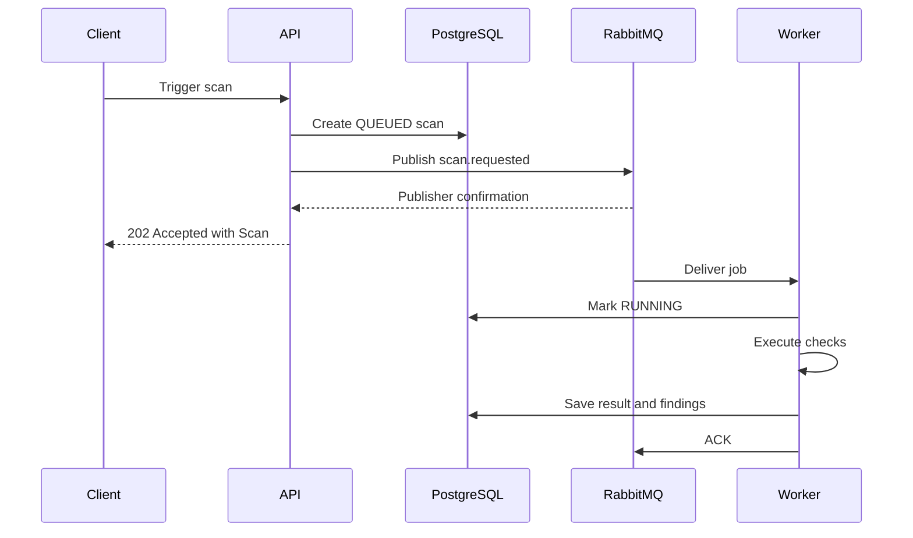

# Architecture

## System components

| Component  | Responsibility                                                                     |
| ---------- | ---------------------------------------------------------------------------------- |
| Web        | User interface for projects, monitors, scans, and findings                         |
| API        | HTTP contract, validation, business orchestration, persistence, and job publishing |
| PostgreSQL | Source of truth for projects, monitors, scans, and findings                        |
| RabbitMQ   | Durable delivery of scan jobs from the API to workers                              |
| Worker     | Fetches targets, performs checks, and persists scan results                        |
| Redis      | Cache, rate limiting, locks, and temporary state; not the primary scan queue       |

## Implementation status

The TypeScript API implements Project, Monitor, and Scan persistence together
with confirmed RabbitMQ publication.

The Python worker is active and implements:

- strict scan message validation;
- idempotent Scan claiming;
- HTTP GET execution with explicit timeouts;
- URL and SSRF safety checks;
- response-time measurement;
- finding generation and persistence;
- bounded delayed retries;
- dead-letter routing;
- connection recovery;
- shutdown resource cleanup;
- structured logging;
- unit and RabbitMQ integration tests.

Authentication and the web client are the next implementation milestones.

## Domain model

```text
Project
└── Monitor
    └── Scan
        └── ScanFinding
```

- A Project groups related monitors.
- A Monitor defines one HTTP or HTTPS target and its interval.
- A Scan represents one execution for a monitor.
- A ScanFinding records an issue discovered during a scan.

Refer to `apps/api/prisma/schema.prisma` for exact fields, enums, relations, indexes, and deletion behavior.

## Scan flow



The API returns `202` only after the confirm channel acknowledges the publication. If publication fails, the API changes the Scan to `FAILED`, sets `finishedAt` and a safe error message, and returns `503 SCAN_QUEUE_UNAVAILABLE`.

RabbitMQ delivery is at-least-once. The worker must therefore treat `scanId` as an idempotency key and avoid processing a completed scan twice.

The database insert and RabbitMQ publish are separate operations. They cannot provide atomic commit semantics: an interrupted or ambiguous publish can leave a database record whose state does not perfectly represent broker delivery. A transactional outbox is the intended upgrade if stronger delivery guarantees become necessary.

### Failure flow

Transient infrastructure errors are retried through dedicated delay queues:

```text
scan.jobs
→ scan.jobs.retry.5s
→ scan.jobs
→ scan.jobs.retry.30s
→ scan.jobs
→ scan.jobs.retry.120s
→ scan.jobs
→ scan.jobs.dead
```

The database remains the source of truth for scan state. RabbitMQ provides
durable delivery but does not replace database idempotency.

A target transport failure, such as a timeout or DNS error, is persisted as a
terminal Scan failure. An HTTP response, including a 4xx or 5xx response, completes
the Scan successfully and may produce a finding. RabbitMQ retry is reserved for
infrastructure failures that prevent the worker from safely finishing the database
lifecycle.

## API module boundaries

```text
route      Registers URL, HTTP method, and OpenAPI schema
controller Parses request data and produces the HTTP response
service    Enforces business rules and coordinates dependencies
repository Performs Prisma queries
```

Infrastructure implementations are accessed through interfaces where tests need substitutes. For example, `ScanService` depends on `ScanQueue`, while production uses `RabbitMqScanQueue` and tests use a fake queue.

`server.ts` is the composition root. Development and production construct `RabbitMqScanQueue`; test mode uses `NoopScanQueue`, while scan integration tests inject a recording fake. The RabbitMQ connection is opened lazily and is closed together with Prisma during Fastify shutdown.

## Worker module boundaries

Worker features live under `ontapulse_worker/modules/<feature>`. The scan module owns
its domain models and errors, application ports and lifecycle service, and inbound
RabbitMQ and outbound HTTP/SQLAlchemy adapters. Adapters depend on application/domain;
the domain does not import HTTPX, Pika, or SQLAlchemy.

`platform` provides shared settings, connection factories, and logging without scan
business rules. `bootstrap/container.py` composes the scan dependencies and owns their
resources. `entrypoints` controls process startup, shutdown, and database readiness.
Tests mirror these boundaries; current adapter tests use mocks, not live infrastructure.

```text
modules/scans/domain
  Scan jobs, results, findings, policies, and errors

modules/scans/application
  Lifecycle orchestration and dependency ports

modules/scans/adapters/inbound
  RabbitMQ contract, topology, retry, and consumer

modules/scans/adapters/outbound/http
  HTTP execution and URL security

modules/scans/adapters/outbound/persistence
  SQLAlchemy Scan and finding persistence

platform
  Configuration, database setup, logging, and resilience

bootstrap
  Dependency construction and resource ownership

entrypoints
  Long-running worker and operational commands
```

Domain and application code do not import Pika, HTTPX, SQLAlchemy, or process
configuration. Concrete dependencies are assembled in the bootstrap layer.

## Validation and errors

Fastify JSON Schema rejects malformed HTTP input before the controller. Zod performs application-level parsing and transformations such as trimming. Both schemas must describe the same accepted input.

Error responses use one contract:

```json
{
  "statusCode": 400,
  "code": "VALIDATION_ERROR",
  "message": "Request validation failed",
  "details": {},
  "requestId": "req-1"
}
```

`details` is optional. Unexpected errors must return a generic message while the technical error is retained in structured server logs.

## Sources of truth

| Information                       | Source                                       |
| --------------------------------- | -------------------------------------------- |
| HTTP request and response schemas | Fastify/OpenAPI route schemas and Swagger UI |
| Application input transformations | Zod schemas                                  |
| Database model                    | `apps/api/prisma/schema.prisma`              |
| Queue payload and delivery rules  | `docs/queue-contract.md`                     |
| Tool commands and local workflow  | `docs/development.md`                        |
