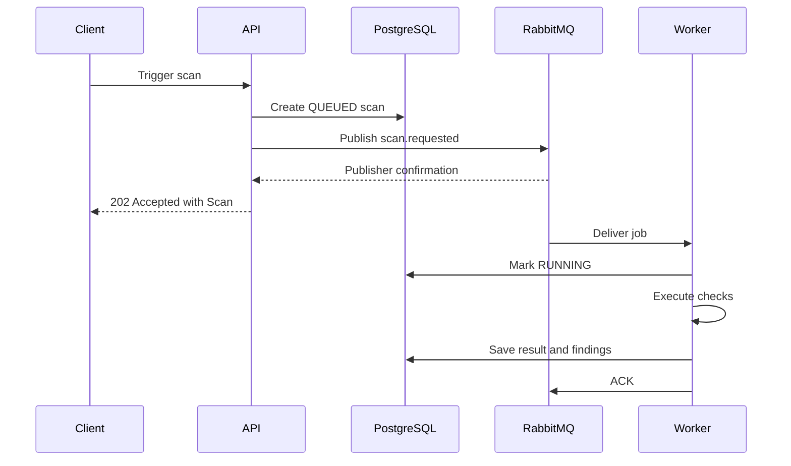

# Architecture

## System components

| Component  | Responsibility                                                                     |
| ---------- | ---------------------------------------------------------------------------------- |
| Web        | User interface for projects, monitors, scans, and findings                         |
| API        | HTTP contract, validation, business orchestration, persistence, and job publishing |
| PostgreSQL | Source of truth for projects, monitors, scans, and findings                        |
| RabbitMQ   | Durable delivery of scan jobs from the API to workers                              |
| Worker     | Fetches targets, performs checks, and persists scan results                        |
| Redis      | Cache, rate limiting, locks, and temporary state; not the primary scan queue       |

## Implementation status

The TypeScript API currently implements Project, Monitor, and Scan persistence and the RabbitMQ producer. The Python worker has configuration, PostgreSQL connectivity, test tooling, an inactive RabbitMQ consumer transport, and an idempotent database lifecycle around an injected scan executor. HTTP checks, findings, bounded retry, and the long-running worker entrypoint are future milestones. The web client is also planned. Because no consumer is running yet, a scan can be accepted and remain `QUEUED` indefinitely without indicating a producer failure.

## Domain model

```text
Project
└── Monitor
    └── Scan
        └── ScanFinding
```

- A Project groups related monitors.
- A Monitor defines one HTTP or HTTPS target and its interval.
- A Scan represents one execution for a monitor.
- A ScanFinding records an issue discovered during a scan.

Refer to `apps/api/prisma/schema.prisma` for exact fields, enums, relations, indexes, and deletion behavior.

## Scan flow



The API returns `202` only after the confirm channel acknowledges the publication. If publication fails, the API changes the Scan to `FAILED`, sets `finishedAt` and a safe error message, and returns `503 SCAN_QUEUE_UNAVAILABLE`.

RabbitMQ delivery is at-least-once. The worker must therefore treat `scanId` as an idempotency key and avoid processing a completed scan twice.

The database insert and RabbitMQ publish are separate operations. They cannot provide atomic commit semantics: an interrupted or ambiguous publish can leave a database record whose state does not perfectly represent broker delivery. A transactional outbox is the intended upgrade if stronger delivery guarantees become necessary.

## API module boundaries

```text
route      Registers URL, HTTP method, and OpenAPI schema
controller Parses request data and produces the HTTP response
service    Enforces business rules and coordinates dependencies
repository Performs Prisma queries
```

Infrastructure implementations are accessed through interfaces where tests need substitutes. For example, `ScanService` depends on `ScanQueue`, while production uses `RabbitMqScanQueue` and tests use a fake queue.

`server.ts` is the composition root. Development and production construct `RabbitMqScanQueue`; test mode uses `NoopScanQueue`, while scan integration tests inject a recording fake. The RabbitMQ connection is opened lazily and is closed together with Prisma during Fastify shutdown.

## Validation and errors

Fastify JSON Schema rejects malformed HTTP input before the controller. Zod performs application-level parsing and transformations such as trimming. Both schemas must describe the same accepted input.

Error responses use one contract:

```json
{
  "statusCode": 400,
  "code": "VALIDATION_ERROR",
  "message": "Request validation failed",
  "details": {},
  "requestId": "req-1"
}
```

`details` is optional. Unexpected errors must return a generic message while the technical error is retained in structured server logs.

## Sources of truth

| Information                       | Source                                       |
| --------------------------------- | -------------------------------------------- |
| HTTP request and response schemas | Fastify/OpenAPI route schemas and Swagger UI |
| Application input transformations | Zod schemas                                  |
| Database model                    | `apps/api/prisma/schema.prisma`              |
| Queue payload and delivery rules  | `docs/queue-contract.md`                     |
| Tool commands and local workflow  | `docs/development.md`                        |
